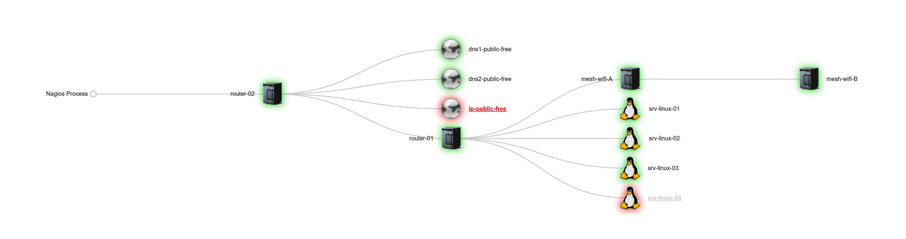

| Cat | Introduction : |
|------|------|
| - A. | [Mise en place d'un serveur DNS (esclave).](#balise_01) |
| - B. | [.](#balise_02) |
| - C. | [.](#balise_03) |
| - D. | [.](#balise_04) |
| - E. | [.](#balise_05) |

# - A. Mise en place d'un serveur DNS (esclave) sur Debian 11 ou Debian 12.

Schéma de principe pour la réalisation de notre maquette de labo.

Affectation des taches de chaques serveurs :

- (srv-linux-01) - Serveur (Nagios Core + NRPE + Smokeping),     192.168.50.200.
- (srv-linux-02) - Serveur (Test),                               192.168.50.201.
- (srv-linux-03) - serveur (DNS maître),                         192.168.50.203.
- (srv-linux-04) - serveur (DNS esclave),                        192.168.50.204.

# Mise en place d'un serveur DNS (esclave) sur Debian 11 ou Debian 12.

