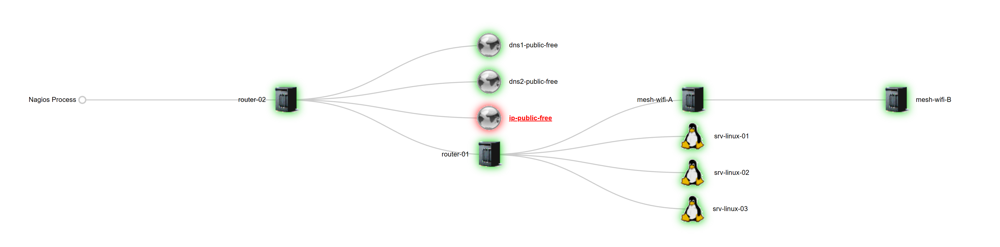

## Exemple server DNS maître.

👋 Sommaire des sujets abordés :

- 01 - [Mise en place d'un serveur DNS (maître).](#balise_01)
- 02 - [Configuration serveur cache.](#balise_02)
- 03 - [Configuration serveur maître.](#balise_03)
- 04 - [Configuration DNS (resolv.conf).](#balise_04)
- 05 - [Tests DNS Master.](#balise_05)

<a name="balise_01"></a>
## - 01 Mise en place d'un serveur DNS (maître) sur Debian 11 ou Debian 12.

Schéma de principe pour la réalisation de notre maquette de labo.

Affectation des taches de chaques serveurs :

- (srv-linux-01) - Serveur (Nagios Core + NRPE + Smokeping),     192.168.50.200.
- (srv-linux-02) - Serveur (Test),                               192.168.50.201.
- (srv-linux-03) - serveur (DNS maître),                         192.168.50.203.



Nous allons voir comment mettre en place un serveur DNS maître (primaire) dans une infrastructure locale. 
Pour assurer la disponibilité de notre serveur maître et également répartir la charge des requêtes DNS, nous mettrons en place un serveur esclave (secondaire). 

Le serveur DNS le plus utilisé dans l’univers GNU/Linux est BIND9 (Berkley Internet Name Domain).

Installer BIND9 sur la machine srv-linux-03.cyberlitech.lan :
```
apt-get install bind9 bind9-doc resolvconf ufw
```
Démarrez le service :
```
systemctl start bind9
```
```
systemctl status bind9

● named.service - BIND Domain Name Server
     Loaded: loaded (/lib/systemd/system/named.service; enabled; preset: enabled)
     Active: active (running) since Sun 2023-07-02 00:00:12 CEST; 3min 20s ago
       Docs: man:named(8)
   Main PID: 1050 (named)
     Status: "running"
      Tasks: 10 (limit: 4644)
     Memory: 42.9M
        CPU: 286ms
     CGroup: /system.slice/named.service
             └─1050 /usr/sbin/named -f -u bind

juil. 02 00:00:12 srv-linux-03 named[1050]: managed-keys-zone: loaded serial 0
juil. 02 00:00:12 srv-linux-03 named[1050]: zone 0.in-addr.arpa/IN: loaded serial 1
juil. 02 00:00:12 srv-linux-03 named[1050]: zone 127.in-addr.arpa/IN: loaded serial 1
juil. 02 00:00:12 srv-linux-03 named[1050]: zone 255.in-addr.arpa/IN: loaded serial 1
juil. 02 00:00:12 srv-linux-03 named[1050]: zone localhost/IN: loaded serial 2
juil. 02 00:00:12 srv-linux-03 named[1050]: all zones loaded
juil. 02 00:00:12 srv-linux-03 named[1050]: running
juil. 02 00:00:12 srv-linux-03 systemd[1]: Started named.service - BIND Domain Name Server.
juil. 02 00:00:22 srv-linux-03 named[1050]: managed-keys-zone: Unable to fetch DNSKEY set '.': timed out
juil. 02 00:00:22 srv-linux-03 named[1050]: resolver priming query complete: timed out
```
<a name="balise_02"></a>
## - 02 Configuration serveur cache.

Par défaut, BIND est déjà configuré en tant que serveur cache. 
Il suffit simplement d’ajouter le ou les serveurs DNS de votre FAI (box internet).212.27.40.240  ou 212.27.40.241

Modifier le fichier /etc/bind/named.conf.options et dé-commenter le bloc :

Avant :
```
nano /etc/bind/named.conf.options

options {
        directory "/var/cache/bind";

        // If there is a firewall between you and nameservers you want
        // to talk to, you may need to fix the firewall to allow multiple
        // ports to talk.  See http://www.kb.cert.org/vuls/id/800113

        // If your ISP provided one or more IP addresses for stable
        // nameservers, you probably want to use them as forwarders.
        // Uncomment the following block, and insert the addresses replacing
        // the all-0's placeholder.

        // forwarders {
        //      0.0.0.0;
        // };
```
Après :
```
options {
        directory "/var/cache/bind";

        // If there is a firewall between you and nameservers you want
        // to talk to, you may need to fix the firewall to allow multiple
        // ports to talk.  See http://www.kb.cert.org/vuls/id/800113

        // If your ISP provided one or more IP addresses for stable
        // nameservers, you probably want to use them as forwarders.
        // Uncomment the following block, and insert the addresses replacing
        // the all-0's placeholder.

        forwarders {
                212.27.40.240;
                212.27.40.241;
        };
```
Enregistrer : Ctrl+o et entrée. Quitter : Ctrl+x

Mettez vos propres serveurs DNS ou n’importe quel serveur OpenDNS.

Serveur DNS google :
```
8.8.8.8
8.8.4.4
```
Serveur DNS Free
```
212.27.40.240
212.27.40.241
```
Sauvegarder et relancer le service BIND :
```
systemctl restart bind9
```
On peut effectuer un test à l’aide de la commande DIG en interrogeant le serveur à partir de lui-même :
```
dig -x 127.0.0.1

; <<>> DiG 9.18.16-1~deb12u1-Debian <<>> -x 127.0.0.1
;; global options: +cmd
;; Got answer:
;; ->>HEADER<<- opcode: QUERY, status: NOERROR, id: 47558
;; flags: qr aa rd ra; QUERY: 1, ANSWER: 1, AUTHORITY: 0, ADDITIONAL: 1

;; OPT PSEUDOSECTION:
; EDNS: version: 0, flags:; udp: 1232
; COOKIE: 7d07425ce70d04290100000064a0a4bdbf9ef261a688da26 (good)
;; QUESTION SECTION:
;1.0.0.127.in-addr.arpa.                IN      PTR

;; ANSWER SECTION:
1.0.0.127.in-addr.arpa. 604800  IN      PTR     localhost.

;; Query time: 4 msec
;; SERVER: ::1#53(::1) (UDP)
;; WHEN: Sun Jul 02 00:12:13 CEST 2023
;; MSG SIZE  rcvd: 102
```
Vous pouvez interroger d’autres domaines par exemple le site :
```
dig cyberlitech.lan

; <<>> DiG 9.18.16-1~deb12u1-Debian <<>> cyberlitech.lan
;; global options: +cmd
;; Got answer:
;; ->>HEADER<<- opcode: QUERY, status: NXDOMAIN, id: 62911
;; flags: qr rd ra ad; QUERY: 1, ANSWER: 0, AUTHORITY: 1, ADDITIONAL:
```
<a name="balise_03"></a>
## - 03 Configuration serveur maître.
Nous allons configurer BIND comme un serveur maître sur le même serveur pour le domaine pixelabs.fr 

Éditez le fichier named.conf.local

Ajoutez les lignes suivante (adapter par rapport à votre conf)
```
nano /etc/bind/named.conf.local

// zone cyberlitech.lan
zone "cyberlitech.lan" IN {
           type master;
           file "/etc/bind/cyberlitech.fw.zone";
           };

// zone inverse cyberlitech.lan
zone "50.168.192.in-addr.arpa" {
           type master;
           file "/etc/bind/cyberlitech.rev.zone";
           };
```
Enregistrer : Ctrl+o et entrée. Quitter : Ctrl+x

Nous allons maintenant créer 2 fichiers que nous avons définis ci-dessus :
```
/etc/bind/cyberlitech.fw.zone
/etc/bind/cyberlitech.rev.zone
```
```
nano /etc/bind/cyberlitech.fw.zone

$TTL    604800
@             IN      SOA     nsmaster.cyberlitech.lan. root.cyberlitech.lan. (
                       20181226         ; Serial
                         604800         ; Refresh
                          86400         ; Retry
                        2419200         ; Expire
                         604800 )       ; Negative Cache TTL

; Serveur DNS

@              IN     NS         srv-linux-03.cyberlitech.lan.
@              IN      A         192.168.50.203

; Resolve DNS

srv-linux-03   IN      A         192.168.50.203

; Machine du domaine

srv-linux-01   IN      A         192.168.50.200
srv-linux-02   IN      A         192.168.50.201
```
Enregistrer : Ctrl+o et entrée. Quitter : Ctrl+x

Vous pouvez rajouter d’autres enregistrements DNS à la suite et n’oubliez pas de rajouter un enregistrement PTR dans la zone inversée (ci-dessous)

Zone Inversée cyberlitech.rev.zone.
Configuration de la zone inversée :
```
cp /etc/bind/db.127 /etc/bind/cyberlitech.rev.zone
```
Éditer le fichier et modifier le domaine et l’adresse du serveur :
```
nano /etc/bind/cyberlitech.rev.zone

;
; BIND reverse data file for local loopback interface
;
$TTL	604800
@	IN	SOA	srv-linux-03.cyberlitech.lan. root.cyberlitech.lan. (
      20181226	        ; Serial
        604800	        ; Refresh
         86400	        ; Retry
       2419200	        ; Expire
        604800 )	; Negative Cache TTL

; Serveur DNS

@	IN	NS	srv-linux-03.cyberlitech.lan.
@	IN	PTR	cyberlitech.lan.

; Resolve DNS

srv-linux-03	IN	A	192.168.50.203

; Machine du domaine

203	IN	PTR	srv-linux-03.cyberlitech.lan.
200	IN	PTR	srv-linux-01.cyberlitech.lan.
201	IN	PTR	srv-linux-02.cyberlitech.lan.
```
Enregistrer : Ctrl+o et entrée. Quitter : Ctrl+x

Remarque :
```
203 = 192.168.50.203 = srv-linux-03
200 = 192.168.50.200 = srv-linux-01
201 = 192.168.50.201 = srv-linux-02
```
<a name="balise_04"></a>
## - 04 Configuration DNS (resolv.conf).
Modifier le fichier resolv.conf. Attention : 
Si ce fichier se met à jour automatiquement (dynamique) par resolvconf, ne pas le modifier manuellement.

C’est le cas pour moi :
```
cat /etc/resolv.conf

# Dynamic resolv.conf(5) file for glibc resolver(3) generated by resolvconf(8)
#     DO NOT EDIT THIS FILE BY HAND -- YOUR CHANGES WILL BE OVERWRITTEN
nameserver 127.0.0.1
search cyberlitech.lan
```
Vous devez alors ajouter le domaine et le serveur DNS depuis le fichier /etc/network/interfaces
```
# the primary network interface
allow-hotplug enp0s3
iface enp0s3 inet static
        address 192.168.50.203/24
        gateway 192.168.50.1
        dns-domain cyberlitech.lan
        dns-nameservers 127.0.0.1
```
Relancez le service réseau :
```
systemctl restart networking
```
<a name="balise_05"></a>
## - 05 Tests DNS Master.
Vérifier la bonne configuration avant de démarrer BIND :

On vérifie la configuration :
```
named-checkconf
```
RAS

Tester la zone principal :
```
named-checkzone cyberlitech.lan /etc/bind/cyberlitech.fw.zone

zone cyberlitech.lan/IN: loaded serial 20181226
OK
```
Tester aussi, la zone inversée :
```
named-checkzone 50.168.192.in-addr.arpa /etc/bind/cyberlitech.rev.zone

zone 50.168.192.in-addr.arpa/IN: loaded serial 20181226
OK
```
Redémarrez le service BIND9.
Vérification de l'état du service BIND9.
```
systemctl restart bind9
systemctl status bind9

● named.service - BIND Domain Name Server
     Loaded: loaded (/lib/systemd/system/named.service; enabled; preset: enabled)
     Active: active (running) since Sun 2023-07-02 01:08:33 CEST; 10s ago
       Docs: man:named(8)
   Main PID: 721 (named)
     Status: "running"
      Tasks: 6 (limit: 4644)
     Memory: 32.6M
        CPU: 35ms
     CGroup: /system.slice/named.service
             └─721 /usr/sbin/named -f -u bind

juil. 02 01:08:33 srv-linux-03 named[721]: zone localhost/IN: loaded serial 2
juil. 02 01:08:33 srv-linux-03 named[721]: zone 127.in-addr.arpa/IN: loaded serial 1
juil. 02 01:08:33 srv-linux-03 named[721]: zone 255.in-addr.arpa/IN: loaded serial 1
juil. 02 01:08:33 srv-linux-03 named[721]: zone 50.168.192.in-addr.arpa/IN: loaded serial 20181226
juil. 02 01:08:33 srv-linux-03 named[721]: all zones loaded
juil. 02 01:08:33 srv-linux-03 named[721]: running
juil. 02 01:08:33 srv-linux-03 systemd[1]: Started named.service - BIND Domain Name Server.
juil. 02 01:08:33 srv-linux-03 named[721]: zone cyberlitech.lan/IN: sending notifies (serial 20181226)
juil. 02 01:08:33 srv-linux-03 named[721]: managed-keys-zone: Key 20326 for zone . is now trusted (acceptance timer complete)
juil. 02 01:08:43 srv-linux-03 named[721]: resolver priming query complete: timed out
```
Tout est OK sur notre machine srv-linux-03 (server DNS maître - 192.168.50.203).

On test la résolution de nom depuis une autre machine :

Nous allons nous connecter à la machine srv-linux-01, puis effectuter les tests depuis celle-ci vers la machine srv-linux-02 (192.168.50.201) :

Configuration en place sur la machine srv-linux-01 (192.168.50.200).

- Configuration du fichier /etc/network/hosts.
```
cat /etc/network/hosts
127.0.0.1       localhost.localdomain           localhost
192.168.50.200  srv-linux-01.cyberlitech.lan    sr-linux-01
```
Configuration en place sur la machine srv-linux-01 (192.168.50.200).

- Configuration du fichier /etc/network/interfaces.
```
cat /etc/network/interfaces

# The primary network interface enp0s3
allow-hotplug enp0s3
iface enp0s3 inet static
   address 192.168.50.200/24
   gateway 192.168.50.1
   dns-domain cyberlitech.lan
   dns-nameservers 192.168.50.203
```
Configuration en place sur la machine srv-linux-01 (192.168.50.200).

- Configuration du fichier /etc/resolv.conf.
```
domain cyberlitech.lan
search cyberlitech.lan
nameserver 192.168.50.203
```
- Test de ping vers 8.8.8.8 depuis la machine srv-linux-01 (192.168.50.200) .
```
ping 8.8.8.8
PING 8.8.8.8 (8.8.8.8) 56(84) bytes of data.
64 bytes from 8.8.8.8: icmp_seq=1 ttl=119 time=19.5 ms
64 bytes from 8.8.8.8: icmp_seq=2 ttl=119 time=21.1 ms
64 bytes from 8.8.8.8: icmp_seq=3 ttl=119 time=19.4 ms
```
Toujours depuis la machine srv-linux-01 (192.168.50.200).

- Test nslookup srv-linux-02 (192.168.50.201) :
```
nslookup srv-linux-02
Server:         192.168.50.203
Address:        192.168.50.203#53

Name:   srv-linux-02.cyberlitech.lan
Address: 192.168.50.201
```
Toujours depuis la machine srv-linux-01 (192.168.50.200).

- Test nslookup 192.168.50.201 vers la machine srv-linux-02 (192.168.50.201) :
```
nslookup 192.168.50.201
201.50.168.192.in-addr.arpa     name = srv-linux-02.cyberlitech.lan.
```
Toujours depuis la machine srv-linux-01 (192.168.50.200).

- Test dig -x 192.168.50.201 (srv-linux-02 - 192.168.50.201) :
```
 dig -x 192.168.50.201

; <<>> DiG 9.18.16-1~deb12u1-Debian <<>> -x 192.168.50.201
;; global options: +cmd
;; Got answer:
;; ->>HEADER<<- opcode: QUERY, status: NOERROR, id: 42538
;; flags: qr aa rd ra; QUERY: 1, ANSWER: 1, AUTHORITY: 0, ADDITIONAL: 1

;; OPT PSEUDOSECTION:
; EDNS: version: 0, flags:; udp: 1232
; COOKIE: 1243d45040e483a40100000064a158a267d640f9ea542732 (good)
;; QUESTION SECTION:
;201.50.168.192.in-addr.arpa.   IN      PTR

;; ANSWER SECTION:
201.50.168.192.in-addr.arpa. 604800 IN  PTR     srv-linux-02.cyberlitech.lan.

;; Query time: 0 msec
;; SERVER: 192.168.50.203#53(192.168.50.203) (UDP)
;; WHEN: Sun Jul 02 12:59:46 CEST 2023
;; MSG SIZE  rcvd: 126
```
Toujours depuis la machine srv-linux-01 (192.168.50.200).

- Test nslookup free.fr (FAI) :
```
nslookup free.fr
Server:         192.168.50.203
Address:        192.168.50.203#53

Non-authoritative answer:
Name:   free.fr
Address: 212.27.48.10
Name:   free.fr
Address: 2a01:e0c:1::1
```
Toujours depuis la machine srv-linux-01 (192.168.50.200).

- Test dig -x free.fr (FAI) :
```
dig -x free.fr

; <<>> DiG 9.18.16-1~deb12u1-Debian <<>> -x free.fr
;; global options: +cmd
;; Got answer:
;; ->>HEADER<<- opcode: QUERY, status: NXDOMAIN, id: 13318
;; flags: qr rd ra ad; QUERY: 1, ANSWER: 0, AUTHORITY: 1, ADDITIONAL: 1

;; OPT PSEUDOSECTION:
; EDNS: version: 0, flags:; udp: 1232
; COOKIE: aa39138fd0fc2fbc0100000064a15b990b85631beede1289 (good)
;; QUESTION SECTION:
;fr.free.in-addr.arpa.          IN      PTR

;; AUTHORITY SECTION:
in-addr.arpa.           709     IN      SOA     b.in-addr-servers.arpa. nstld.iana.org. 2022091606 1800 900 604800 3600

;; Query time: 4 msec
;; SERVER: 192.168.50.203#53(192.168.50.203) (UDP)
;; WHEN: Sun Jul 02 13:12:25 CEST 2023
;; MSG SIZE  rcvd: 161
```
