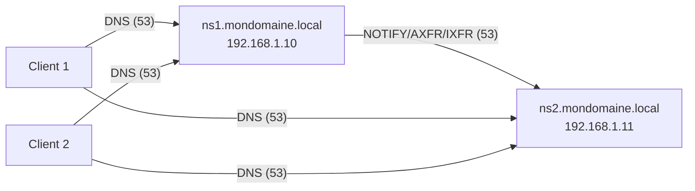

<div align="center">

  <br></br>
  
  <a href="https://github.com/0xCyberLiTech">
    
  </a>
  
  <br></br>
  
  <h2>Laboratoire numérique pour la cybersécurité, Linux & IT.</h2>

  <p align="center">
    <a href="https://0xcyberlitech.github.io/">
      
    </a>
    <a href="https://github.com/0xCyberLiTech">
      
    </a>
    <a href="https://github.com/0xCyberLiTech/DNS/releases/latest">
      
    </a>
    <a href="https://github.com/0xCyberLiTech/DNS/blob/main/CHANGELOG.md">
      
    </a>
    <a href="https://github.com/0xCyberLiTech?tab=repositories">
      
    </a>
    <a href="https://github.com/0xCyberLiTech/DNS/graphs/contributors">
      
    </a>
  </p>

</div>

<div align="center">
  
</div>

<div align="center">
  <p>
    <strong>Cybersécurité</strong>  • <strong>Linux Debian</strong>  • <strong>Sécurité informatique</strong> 
  </p>
</div>

---

<div align="center">
  
## À propos & Objectifs.

</div>

Ce projet propose des solutions innovantes et accessibles en cybersécurité, avec une approche centrée sur la simplicité d’utilisation et l’efficacité. Il vise à accompagner les utilisateurs dans la protection de leurs données et systèmes, tout en favorisant l’apprentissage et le partage des connaissances.

Le contenu est structuré, accessible et optimisé SEO pour répondre aux besoins de :
- 🎓 Étudiants : approfondir les connaissances
- 👨‍💻 Professionnels IT : outils et pratiques
- 🖥️ Administrateurs système : sécuriser l’infrastructure
- 🛡️ Experts cybersécurité : ressources techniques
- 🚀 Passionnés du numérique : explorer les bonnes pratiques

---

# TP pas à pas — Installation & configuration d’un **serveur DNS Esclave (Secondaire)** avec **BIND9** sous **Debian 12 (Bookworm)**

> **Objectif pédagogique**  
> Déployer un **serveur DNS secondaire** (esclave) synchronisé automatiquement avec un **DNS maître**, pour assurer **redondance**, **haute disponibilité**, et **sécurité** (TSIG).  
> À la fin du TP, vous aurez :
> 1) un **ns1** (maître) qui notifie et autorise ns2,  
> 2) un **ns2** (esclave) qui réplique les zones (AXFR/IXFR),  
> 3) des **tests** de transfert, de résolution et de bascule,  
> 4) une **sécurisation** avec **TSIG** et pare‑feu.

---

## 0) Contexte, prérequis & topologie

- **DNS Maître** : `ns1.mondomaine.local` — **192.168.1.10**
- **DNS Esclave** : `ns2.mondomaine.local` — **192.168.1.11**
- **Zones** : `mondomaine.local` (directe) et `1.168.192.in-addr.arpa` (inverse)
- **Clients** : utilisent **deux DNS** (ns1 & ns2)

> **Version attendue** (Debian 12) : `named -v` → **BIND 9.18.x**

### Schéma ASCII
```
          ┌───────────────┐
          │  ns1 (Maître) │ 192.168.1.10
          └───────▲───────┘
                  │  NOTIFY + AXFR/IXFR (53/UDP+TCP)
                  ▼
          ┌───────────────┐
          │ ns2 (Esclave) │ 192.168.1.11
          └───────┬───────┘
                  │  DNS 53/UDP+TCP
     ┌────────────┴─────────────┐
     │                          │
 ┌───────┐                 ┌───────┐
 │Client │                 │Client │
 └───────┘                 └───────┘
 (résolveurs = ns1 & ns2)
```

### Schéma Mermaid (coller dans https://mermaid.live/)


---

## 1) Préparation sur **ns1 (Maître)**

### 1.1 Autoriser ns2 et notifier les changements
Éditer **/etc/bind/named.conf.local** sur **ns1** :
```conf
zone "mondomaine.local" {
    type master;
    file "/etc/bind/db.mondomaine.local";
    allow-transfer { 192.168.1.11; };     // Autoriser l'esclave
    also-notify   { 192.168.1.11; };      // Notifier ns2 à chaque modif
};

zone "1.168.192.in-addr.arpa" {
    type master;
    file "/etc/bind/db.192.168.1";
    allow-transfer { 192.168.1.11; };
    also-notify   { 192.168.1.11; };
};
```

> **Bonnes pratiques** : créer une ACL (ex. `acl "dns-slaves" { 192.168.1.11; };`) et l’utiliser dans toutes les zones.

Rechargez la conf :
```bash
sudo rndc reload
```

### 1.2 Vérifier que les zones du maître sont correctes
```bash
sudo named-checkconf
sudo named-checkzone mondomaine.local /etc/bind/db.mondomaine.local
sudo named-checkzone 1.168.192.in-addr.arpa /etc/bind/db.192.168.1
```

---

## 2) Installation de BIND9 sur **ns2 (Esclave)**

```bash
sudo apt update && sudo apt -y upgrade
sudo apt install -y bind9 bind9-utils bind9-dnsutils
named -v   # BIND 9.18.x
```

---

## 3) Configuration **Esclave** sur ns2

### 3.1 Déclarer les zones secondaires
Éditer **/etc/bind/named.conf.local** sur **ns2** :
```conf
zone "mondomaine.local" {
    type slave;                           // secondaire
    masters { 192.168.1.10; };            // maître
    file "/var/cache/bind/db.mondomaine.local";  // génération automatique
    allow-notify { 192.168.1.10; };       // accepte NOTIFY du maître
};

zone "1.168.192.in-addr.arpa" {
    type slave;
    masters { 192.168.1.10; };
    file "/var/cache/bind/db.192.168.1";
    allow-notify { 192.168.1.10; };
};
```

> **Note** : ne **créez pas** les fichiers de zone côté esclave ; ils se rempliront automatiquement au premier **AXFR/IXFR**.

### 3.2 Vérifier et démarrer
```bash
sudo named-checkconf
sudo systemctl restart bind9
sudo systemctl enable bind9
systemctl status bind9 --no-pager
journalctl -u bind9 -b --no-pager
```

### 3.3 Contrôler la présence des fichiers transférés
```bash
ls -l /var/cache/bind/
```
Vous devriez voir :
```
db.mondomaine.local
db.192.168.1
```

---

## 4) Tests de **transfert** et de **résolution**

### 4.1 Tester la zone sur ns2
```bash
dig @192.168.1.11 mondomaine.local SOA +noall +answer
dig @192.168.1.11 www.mondomaine.local A +noall +answer
dig @192.168.1.11 -x 192.168.1.20 +noall +answer
```

### 4.2 Forcer un changement sur ns1 et vérifier la réplication
1. Sur **ns1**, modifiez un enregistrement (ex. `www`) et **incrémentez le Serial** dans le **SOA** de `db.mondomaine.local` (format conseillé `YYYYMMDDnn`).  
2. Rechargez la zone et notifiez :
   ```bash
   sudo rndc reload mondomaine.local
   sudo rndc notify mondomaine.local
   ```
3. Sur **ns2**, surveillez les logs puis vérifiez le **Serial** :
   ```bash
   journalctl -u bind9 -f
   dig @192.168.1.11 mondomaine.local SOA +noall +answer
   ```
> Le **Serial** doit être **identique** sur ns1 et ns2 après IXFR/AXFR.

### 4.3 Test de **bascule** (tolérance de panne)
1. Arrêter BIND9 sur ns1 :  
   ```bash
   sudo systemctl stop bind9   # sur ns1
   ```
2. Depuis un client, interroger ns2 :  
   ```bash
   dig @192.168.1.11 www.mondomaine.local +noall +answer
   ```
3. **Attendu** : ns2 répond toujours ✅

---

## 5) (Optionnel mais recommandé) **Sécuriser** le transfert avec **TSIG**

### 5.1 Générer une clé TSIG (sur ns1)
```bash
sudo tsig-keygen -a hmac-sha256 ns1-ns2-key > /etc/bind/keys/ns1-ns2.key
sudo chown root:bind /etc/bind/keys/ns1-ns2.key
sudo chmod 640 /etc/bind/keys/ns1-ns2.key
```
Le fichier contient un bloc `key` comme :
```conf
key "ns1-ns2-key" {
    algorithm hmac-sha256;
    secret "BASE64SECRET...";
};
```

**Copiez** le contenu de ce bloc **à l’identique** sur **ns2** (ex. `/etc/bind/keys/ns1-ns2.key` avec les mêmes permissions).

### 5.2 Déclarer la clé et l’utiliser (ns1 & ns2)

#### Sur **ns1** (Maître)
Dans **/etc/bind/named.conf** (ou un fichier inclus, ex. `/etc/bind/named.conf.keys`) :
```conf
include "/etc/bind/keys/ns1-ns2.key";

server 192.168.1.11 {
    keys { "ns1-ns2-key"; };
};
```

Dans **/etc/bind/named.conf.local**, remplacez/complétez :
```conf
zone "mondomaine.local" {
    type master;
    file "/etc/bind/db.mondomaine.local";
    allow-transfer { key "ns1-ns2-key"; 192.168.1.11; };
    also-notify   { 192.168.1.11 key "ns1-ns2-key"; };
};

zone "1.168.192.in-addr.arpa" {
    type master;
    file "/etc/bind/db.192.168.1";
    allow-transfer { key "ns1-ns2-key"; 192.168.1.11; };
    also-notify   { 192.168.1.11 key "ns1-ns2-key"; };
};
```

#### Sur **ns2** (Esclave)
Dans **/etc/bind/named.conf** (ou inclus) :
```conf
include "/etc/bind/keys/ns1-ns2.key";

server 192.168.1.10 {
    keys { "ns1-ns2-key"; };
};
```

Dans **/etc/bind/named.conf.local** :
```conf
zone "mondomaine.local" {
    type slave;
    masters { 192.168.1.10 key "ns1-ns2-key"; };
    file "/var/cache/bind/db.mondomaine.local";
    allow-notify { 192.168.1.10; };
};

zone "1.168.192.in-addr.arpa" {
    type slave;
    masters { 192.168.1.10 key "ns1-ns2-key"; };
    file "/var/cache/bind/db.192.168.1";
    allow-notify { 192.168.1.10; };
};
```

Rechargez sur **les deux** :
```bash
sudo rndc reconfig
sudo rndc reload
```

**Testez** que l’AXFR **échoue sans clé** et **réussit avec** :  
Depuis ns2, un AXFR explicite avec clé n’est pas lancé via `dig` (qui gère TSIG en ligne de commande), mais vous pouvez vérifier via les **logs** que le transfert s’effectue suite à un `NOTIFY` et qu’il est **signé**.  
> Bonus : `dig AXFR mondomaine.local @192.168.1.10` **devrait échouer** (REFUSED) si vous n’autorisez pas l’AXFR sans clé—c’est voulu.

---

## 6) Pare‑feu (UFW / nftables)

### UFW — ouvrir DNS entre ns1 et ns2 + clients LAN
```bash
sudo ufw allow 53/udp
sudo ufw allow 53/tcp
# (Optionnel) limiter l'accès aux plages LAN :
# sudo ufw allow from 192.168.1.0/24 to any port 53 proto udp
# sudo ufw allow from 192.168.1.0/24 to any port 53 proto tcp
sudo ufw reload
sudo ufw status
```

### nftables — exemple minimal (sur ns2)
```nft
table inet filter {
  chain input {
    type filter hook input priority 0;

    iif "lo" accept
    ct state established,related accept

    # Autoriser DNS depuis le LAN
    ip saddr 192.168.1.0/24 udp dport 53 accept
    ip saddr 192.168.1.0/24 tcp dport 53 accept

    # (Optionnel) restreindre davantage aux IP ns1/clients autorisés
    # ip saddr 192.168.1.10 tcp dport 53 accept
    # ip saddr 192.168.1.10 udp dport 53 accept

    reject with icmpx type admin-prohibited
  }
}
```

Appliquer et activer :
```bash
sudo nft -f /etc/nftables.conf
sudo systemctl enable nftables
```

---

## 7) Configuration des **clients** (résolveurs)

Configurer **deux serveurs DNS** (ordre différent possible selon vos politiques) :  
- Linux (ex. NetworkManager) : `nameserver 192.168.1.10` et `nameserver 192.168.1.11`  
- Windows : ajouter les deux DNS dans IPv4 de l’interface réseau

Tests depuis client :
```bash
dig www.mondomaine.local +noall +answer
dig -x 192.168.1.20 +noall +answer
```

---

## 8) Dépannage — erreurs fréquentes & solutions

- **Transfert ne démarre pas** :  
  - vérifier `allow-transfer` sur **ns1** et `masters` sur **ns2**  
  - vérifier **pare‑feu** (TCP/53 pour AXFR, UDP/53 pour NOTIFY)  
  - consulter `journalctl -u bind9` sur ns1 et ns2
- **Serial identique mais ns2 pas à jour** :  
  - forcer `sudo rndc notify <zone>` et `sudo rndc reload <zone>` sur ns1  
  - supprimer une éventuelle zone cache sur ns2 : `sudo rm /var/cache/bind/db.mondomaine.local*` puis `sudo systemctl restart bind9`
- **AXFR non autorisé** via `dig AXFR` : normal si vous avez **bloqué** l’AXFR sans clé (sécurité souhaitable)
- **TSIG échec** : clés non identiques, permissions fichier (640, root:bind), include non chargé, horloge désynchronisée (NTP)
- **NXDOMAIN/SERVFAIL** : faute de frappe, FQDN sans point final, zone maître invalide → `named-checkzone`

---

## 9) Validation des acquis (quiz)

1. Quel port et protocole sont utilisés pour **AXFR** ?  
2. Quel champ **doit être incrémenté** à chaque changement de zone et pourquoi ?  
3. Comment **forcer** l’envoi d’un NOTIFY ?  
4. Pourquoi utiliser **TSIG** entre ns1 et ns2 ?  
5. Que vérifiez‑vous pour confirmer que ns2 est **synchronisé** ?

**Réponses attendues** :  
1) **TCP/53** (AXFR), NOTIFY en **UDP/53**.  
2) **Serial** du **SOA**, pour déclencher la réplication IXFR/AXFR.  
3) `sudo rndc notify <zone>` (ou `rndc reload` puis NOTIFY automatique).  
4) Authenticité et intégrité des transferts (éviter l’usurpation).  
5) Le **Serial** SOA identique entre ns1 et ns2 (`dig SOA`), et réponses cohérentes aux requêtes.

---

## 10) Annexes — modèles de fichiers

### A) ns1 (Maître) — extraits

**/etc/bind/named.conf.options** (extrait minimal autorité)
```conf
options {
    directory "/var/cache/bind";
    listen-on { 127.0.0.1; 192.168.1.10; };
    listen-on-v6 { none; };
    recursion no;
    allow-query { 127.0.0.1; 192.168.1.0/24; };
    allow-transfer { none; }; // sur chaque zone : exception pour ns2
    version "not disclosed";
};
```

**/etc/bind/named.conf.local**
```conf
acl "dns-slaves" { 192.168.1.11; };

zone "mondomaine.local" {
    type master;
    file "/etc/bind/db.mondomaine.local";
    allow-transfer { dns-slaves; };
    also-notify   { 192.168.1.11; };
};

zone "1.168.192.in-addr.arpa" {
    type master;
    file "/etc/bind/db.192.168.1";
    allow-transfer { dns-slaves; };
    also-notify   { 192.168.1.11; };
};
```

### B) ns2 (Esclave) — extraits

**/etc/bind/named.conf.options**
```conf
options {
    directory "/var/cache/bind";
    listen-on { 127.0.0.1; 192.168.1.11; };
    listen-on-v6 { none; };
    recursion no;
    allow-query { 127.0.0.1; 192.168.1.0/24; };
    allow-transfer { none; };
    version "not disclosed";
};
```

**/etc/bind/named.conf.local**
```conf
zone "mondomaine.local" {
    type slave;
    masters { 192.168.1.10; };
    file "/var/cache/bind/db.mondomaine.local";
    allow-notify { 192.168.1.10; };
};

zone "1.168.192.in-addr.arpa" {
    type slave;
    masters { 192.168.1.10; };
    file "/var/cache/bind/db.192.168.1";
    allow-notify { 192.168.1.10; };
};
```

### C) TSIG — bloc `key` (à inclure des **deux** côtés)
```conf
key "ns1-ns2-key" {
    algorithm hmac-sha256;
    secret "BASE64SECRET...";
};
```

> **Remarques terminologie** : BIND et la doc récente parlent parfois de **primary/secondary** en plus de **master/slave**. Sous Debian 12 BIND 9.18, `type slave;` reste valable.

---

**Fin du TP **

Vous avez un **DNS esclave** fonctionnel, testé, et sécurisé (TSIG), prêt à soutenir la production.

---

<div align="center">
  <a href="https://github.com/0xCyberLiTech" target="_blank" rel="noopener">
    
  </a>
</div>

<div align="center">
  <b>🔒 Un guide proposé par <a href="https://github.com/0xCyberLiTech">0xCyberLiTech</a> • Pour des tutoriels accessibles à tous. 🔒</b>
</div>

