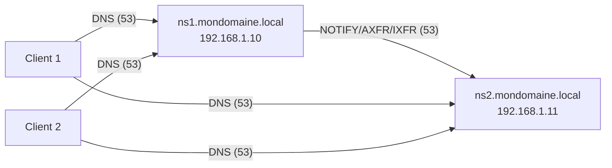

<div align="center">

  <br></br>
  
  <a href="https://github.com/0xCyberLiTech">
    
  </a>
  
  <br></br>
  
  <h2>Laboratoire numérique pour la cybersécurité, Linux & IT</h2>


  <p align="center">
    <a href="https://0xcyberlitech.github.io/">
      
    </a>
    <a href="https://github.com/0xCyberLiTech">
      
    </a>
    <a href="https://github.com/0xCyberLiTech/DNS/releases/latest">
      
    </a>
    <a href="https://github.com/0xCyberLiTech/DNS/blob/main/CHANGELOG.md">
      
    </a>
    <a href="https://github.com/0xCyberLiTech?tab=repositories">
      
    </a>
    <a href="https://github.com/0xCyberLiTech/DNS/graphs/contributors">
      
    </a>
  </p>

</div>

<!--
Optimisation SEO : mots-clés cybersécurité, Linux, administration système, sécurité informatique, tutoriels, guides, expertise, formation, supervision, Docker, OpenVAS, firewall, proxy, DNS, SSH, Debian, IT, réseau, cryptographie, open source, ressources techniques, étudiants, professionnels, passionnés.
-->

<div align="center">
  
</div>

<div align="center">
  <p>
    <strong>Cybersécurité</strong>  • <strong>Linux Debian</strong>  • <strong>Sécurité informatique</strong> 
  </p>
</div>

---

## 🚀 À propos & Objectifs

Ce projet propose des solutions innovantes et accessibles en cybersécurité, avec une approche centrée sur la simplicité d’utilisation et l’efficacité. Il vise à accompagner les utilisateurs dans la protection de leurs données et systèmes, tout en favorisant l’apprentissage et le partage des connaissances.

Le contenu est structuré, accessible et optimisé SEO pour répondre aux besoins de :
- 🎓 Étudiants : approfondir les connaissances
- 👨‍💻 Professionnels IT : outils et pratiques
- 🖥️ Administrateurs système : sécuriser l’infrastructure
- 🛡️ Experts cybersécurité : ressources techniques
- 🚀 Passionnés du numérique : explorer les bonnes pratiques

---


# TP pas à pas — Installation & configuration d’un **serveur DNS Esclave (Secondaire)** avec **BIND9** sous **Debian 13 (Trixie)**

> **Objectif pédagogique**  
> Déployer un **serveur DNS secondaire** (esclave) synchronisé automatiquement avec un **DNS maître**, pour assurer **redondance**, **haute disponibilité**, et **sécurité** (TSIG).  
> À la fin du TP, vous aurez :
> 1) un **ns1** (maître) qui notifie et autorise ns2,  
> 2) un **ns2** (esclave) qui réplique les zones (AXFR/IXFR),  
> 3) des **tests** de transfert, de résolution et de bascule,  
> 4) une **sécurisation** avec **TSIG** et pare‑feu.

---

## 0) Contexte, prérequis & topologie

- **DNS Maître** : `ns1.mondomaine.local` — **192.168.1.10**
- **DNS Esclave** : `ns2.mondomaine.local` — **192.168.1.11**
- **Zones** : `mondomaine.local` (directe) et `1.168.192.in-addr.arpa` (inverse)
- **Clients** : utilisent **deux DNS** (ns1 & ns2)

> **Version attendue** (Debian 13) : `named -v` → **BIND 9.20.x**

### Schéma ASCII
```
          ┌───────────────┐
          │  ns1 (Maître) │ 192.168.1.10
          └───────▲───────┘
                  │  NOTIFY + AXFR/IXFR (53/UDP+TCP)
                  ▼
          ┌───────────────┐
          │ ns2 (Esclave) │ 192.168.1.11
          └───────┬───────┘
                  │  DNS 53/UDP+TCP
     ┌────────────┴─────────────┐
     │                          │
 ┌───────┐                 ┌───────┐
 │Client │                 │Client │
 └───────┘                 └───────┘
 (résolveurs = ns1 & ns2)
```

### Schéma Mermaid (coller dans https://mermaid.live/)


---

## 1) Préparation sur **ns1 (Maître)**

### 1.1 Autoriser ns2 et notifier les changements
Éditer **/etc/bind/named.conf.local** sur **ns1** :
```conf
zone "mondomaine.local" {
    type master;
    file "/etc/bind/db.mondomaine.local";
    allow-transfer { 192.168.1.11; };
    also-notify   { 192.168.1.11; };
};

zone "1.168.192.in-addr.arpa" {
    type master;
    file "/etc/bind/db.192.168.1";
    allow-transfer { 192.168.1.11; };
    also-notify   { 192.168.1.11; };
};
```

### 1.2 Vérifier les zones
```bash
sudo named-checkconf
sudo named-checkzone mondomaine.local /etc/bind/db.mondomaine.local
sudo named-checkzone 1.168.192.in-addr.arpa /etc/bind/db.192.168.1
```

---

## 2) Installation de BIND9 sur **ns2 (Esclave)**

```bash
sudo apt update && sudo apt -y upgrade
sudo apt install -y bind9 bind9-utils bind9-dnsutils
named -v   # BIND 9.20.x
```

---

## 3) Configuration **Esclave** sur ns2

### 3.1 Déclarer les zones secondaires
Éditer **/etc/bind/named.conf.local** sur **ns2** :
```conf
zone "mondomaine.local" {
    type slave;
    masters { 192.168.1.10; };
    file "/var/cache/bind/db.mondomaine.local";
    allow-notify { 192.168.1.10; };
};

zone "1.168.192.in-addr.arpa" {
    type slave;
    masters { 192.168.1.10; };
    file "/var/cache/bind/db.192.168.1";
    allow-notify { 192.168.1.10; };
};
```

### 3.2 Vérifier et démarrer
```bash
sudo named-checkconf
sudo systemctl restart bind9
sudo systemctl enable bind9
systemctl status bind9 --no-pager
```

### 3.3 Contrôler le transfert
```bash
ls -l /var/cache/bind/
```
Fichiers attendus :
```
db.mondomaine.local
db.192.168.1
```

---

## 4) Tests

### 4.1 Vérifier la résolution
```bash
dig @192.168.1.11 mondomaine.local SOA +noall +answer
dig @192.168.1.11 www.mondomaine.local A +noall +answer
dig @192.168.1.11 -x 192.168.1.20 +noall +answer
```

### 4.2 Test de réplication
- Modifier une zone sur ns1, incrémenter le **Serial** du SOA  
- Recharger ns1 :  
  ```bash
  sudo rndc reload mondomaine.local
  sudo rndc notify mondomaine.local
  ```
- Vérifier sur ns2 :  
  ```bash
  dig @192.168.1.11 mondomaine.local SOA +noall +answer
  ```

### 4.3 Test de bascule
- Arrêter ns1 : `sudo systemctl stop bind9`  
- Depuis client :  
  ```bash
  dig @192.168.1.11 www.mondomaine.local +noall +answer
  ```
- ✅ ns2 doit répondre

---

## 5) Sécurisation avec TSIG

### 5.1 Générer une clé (sur ns1)
```bash
sudo tsig-keygen -a hmac-sha256 ns1-ns2-key > /etc/bind/keys/ns1-ns2.key
```

### 5.2 Déclarer la clé sur ns1 et ns2

#### ns1
```conf
include "/etc/bind/keys/ns1-ns2.key";

server 192.168.1.11 {
    keys { "ns1-ns2-key"; };
};
```

Zones :
```conf
zone "mondomaine.local" {
    type master;
    file "/etc/bind/db.mondomaine.local";
    allow-transfer { key "ns1-ns2-key"; 192.168.1.11; };
    also-notify   { 192.168.1.11 key "ns1-ns2-key"; };
};
```

#### ns2
```conf
include "/etc/bind/keys/ns1-ns2.key";

server 192.168.1.10 {
    keys { "ns1-ns2-key"; };
};

zone "mondomaine.local" {
    type slave;
    masters { 192.168.1.10 key "ns1-ns2-key"; };
    file "/var/cache/bind/db.mondomaine.local";
};
```

Recharge :
```bash
sudo rndc reconfig
sudo rndc reload
```

---

## 6) Pare-feu

**UFW**
```bash
sudo ufw allow 53/udp
sudo ufw allow 53/tcp
sudo ufw reload
```

**nftables**
```nft
table inet filter {
  chain input {
    type filter hook input priority 0;
    iif "lo" accept
    ct state established,related accept
    ip saddr 192.168.1.0/24 udp dport 53 accept
    ip saddr 192.168.1.0/24 tcp dport 53 accept
    reject with icmpx type admin-prohibited
  }
}
```

---

## 7) Configuration des clients

Clients → deux serveurs DNS :  
```
nameserver 192.168.1.10
nameserver 192.168.1.11
```

---

## 8) Dépannage

- **Pas de transfert** : vérifier `allow-transfer` (ns1) et `masters` (ns2), firewall TCP/53
- **Serial pas synchro** : forcer `rndc notify <zone>` sur ns1
- **TSIG échec** : clé non identique, mauvais include, permissions fichier, horloge désynchronisée
- **NXDOMAIN** : fautes dans zone maître

Commandes utiles :
```bash
sudo named-checkconf
sudo rndc reload
journalctl -u bind9 -f
```

---

**Fin du TP **

---

<div align="center">
  <a href="https://github.com/0xCyberLiTech" target="_blank" rel="noopener">
    
  </a>
</div>

<div align="center">
  <b>🔒 Un guide proposé par <a href="https://github.com/0xCyberLiTech">0xCyberLiTech</a> • Pour des tutoriels accessibles à tous. 🔒</b>
</div>

