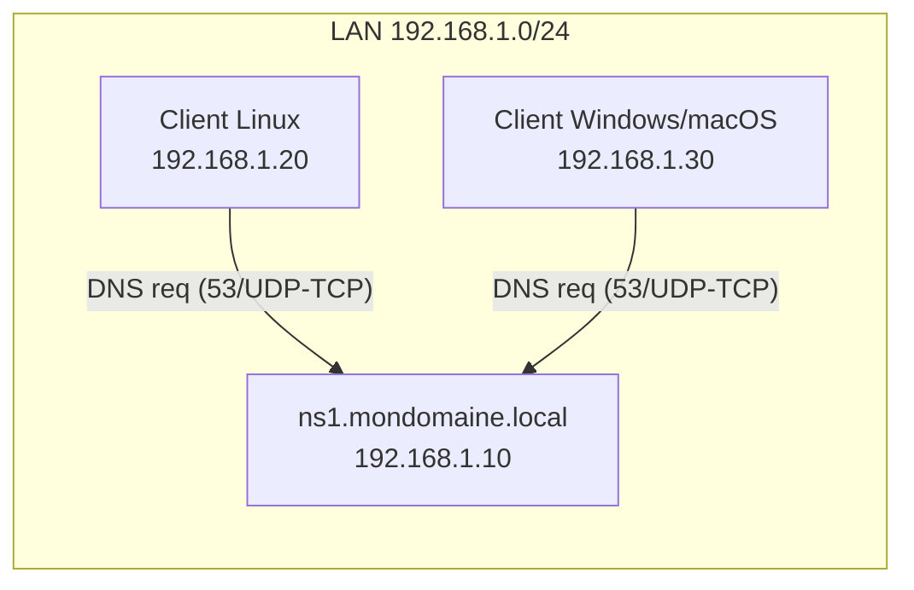

<div align="center">

  <br></br>
  
  <a href="https://github.com/0xCyberLiTech">
    
  </a>
  
  <br></br>
  
  <h2>Laboratoire numérique pour la cybersécurité, Linux & IT</h2>


  <p align="center">
    <a href="https://0xcyberlitech.github.io/">
      
    </a>
    <a href="https://github.com/0xCyberLiTech">
      
    </a>
    <a href="https://github.com/0xCyberLiTech/DNS/releases/latest">
      
    </a>
    <a href="https://github.com/0xCyberLiTech/DNS/blob/main/CHANGELOG.md">
      
    </a>
    <a href="https://github.com/0xCyberLiTech?tab=repositories">
      
    </a>
    <a href="https://github.com/0xCyberLiTech/DNS/graphs/contributors">
      
    </a>
  </p>

</div>

<!--
Optimisation SEO : mots-clés cybersécurité, Linux, administration système, sécurité informatique, tutoriels, guides, expertise, formation, supervision, Docker, OpenVAS, firewall, proxy, DNS, SSH, Debian, IT, réseau, cryptographie, open source, ressources techniques, étudiants, professionnels, passionnés.
-->

<div align="center">
  
</div>

<div align="center">
  <p>
    <strong>Cybersécurité</strong>  • <strong>Linux Debian</strong>  • <strong>Sécurité informatique</strong> 
  </p>
</div>

---

## 🚀 À propos & Objectifs

Ce projet propose des solutions innovantes et accessibles en cybersécurité, avec une approche centrée sur la simplicité d’utilisation et l’efficacité. Il vise à accompagner les utilisateurs dans la protection de leurs données et systèmes, tout en favorisant l’apprentissage et le partage des connaissances.

Le contenu est structuré, accessible et optimisé SEO pour répondre aux besoins de :
- 🎓 Étudiants : approfondir les connaissances
- 👨‍💻 Professionnels IT : outils et pratiques
- 🖥️ Administrateurs système : sécuriser l’infrastructure
- 🛡️ Experts cybersécurité : ressources techniques
- 🚀 Passionnés du numérique : explorer les bonnes pratiques

---

# TP pas à pas — Installation & configuration d’un **serveur DNS Maître** (BIND9) sous **Debian 12 (Bookworm)**

> **Objectif pédagogique**  
> À la fin de ce TP, vous saurez installer, configurer, tester et sécuriser un **serveur DNS maître** avec **BIND9** sur Debian 12.  
> Vous créerez une **zone directe** et une **zone inverse**, vérifierez la configuration, puis effectuerez des tests de résolution depuis le serveur et un poste client.

---

## 0) Contexte, prérequis & topologie

### Contexte
- Système : **Debian 12 (Bookworm)**, à jour
- Rôle : **DNS Maître** pour un domaine interne d’exemple `mondomaine.local`
- Hôte DNS : `ns1.mondomaine.local`
- IP fixe : `192.168.1.10/24` (passerelle `192.168.1.1`)

> Adaptez *domaine*, *noms d’hôtes* et *adresses IP* à votre environnement.

### Pré-requis
- Accès `sudo` ou root
- Heure système correcte (NTP de préférence)
- Un poste client Linux (Debian/Ubuntu) ou Windows pour tester

### Schéma de la topologie (ASCII)
```
             ┌───────────────────────────────────────────┐
             │                Réseau LAN                 │
             │                192.168.1.0/24             │
             └───────────────────────────────────────────┘
                        │
                        │
                ┌───────┴────────┐
                │   DNS Maître   │
                │ ns1.mondomaine │
                │ 192.168.1.10   │
                └───────┬────────┘
                        │
        ┌───────────────┴────────────────┐
        │                                │
┌───────▼────────┐                ┌──────▼────────┐
│  Client Linux  │                │ Client Win/OS │
│ 192.168.1.20   │                │ 192.168.1.30  │
└────────────────┘                └───────────────┘
        (utilisent ns1 = 192.168.1.10 comme résolveur primaire)
```

### Schéma Mermaid (collable dans https://mermaid.live/)


---

## 1) Étape 1 — Préparer l’IP **statique** du serveur

1. Vérifier l’interface réseau :  
   ```bash
   ip -br a
   ```
2. Configurer l’IP statique via **systemd-networkd** ou **NetworkManager**. Exemple (NetworkManager, fichier keyfile) :
   ```ini
   # /etc/NetworkManager/system-connections/lan.nmconnection
   [connection]
   id=lan
   type=ethernet
   interface-name=eth0
   autoconnect=true

   [ipv4]
   method=manual
   addresses=192.168.1.10/24
   gateway=192.168.1.1
   dns=127.0.0.1;
   dns-search=mondomaine.local;

   [ipv6]
   method=disabled
   ```
   Puis :
   ```bash
   sudo nmcli connection reload
   sudo nmcli connection up lan
   ```

> **Pourquoi `dns=127.0.0.1` ?** Sur le **serveur DNS**, on résoudra en local via BIND9.  
> **Sur les clients**, on pointera vers **192.168.1.10** (ns1).

---

## 2) Étape 2 — Installer BIND9 et outils

```bash
sudo apt update && sudo apt -y upgrade
sudo apt install -y bind9 bind9-utils bind9-dnsutils
named -v     # doit afficher BIND 9.18.x (Debian 12)
```

Fichiers principaux utiles (Debian) :  
- `/etc/bind/named.conf` (inclut les autres)  
- `/etc/bind/named.conf.options` (options globales)  
- `/etc/bind/named.conf.local` (déclaration des zones locales)  
- `/var/cache/bind/` (cache, clés…)  
- Journaux via `journalctl -u bind9` (par défaut, AppArmor actif)

---

## 3) Étape 3 — Paramètres globaux de BIND9

Éditez **/etc/bind/named.conf.options** :
```bash
sudo nano /etc/bind/named.conf.options
```
Exemple **sécurisé pour un DNS d’autorité (maître)** dans un LAN :
```conf
options {
    directory "/var/cache/bind";

    // Écoute sur l’IPv4 locale et l’IP du LAN
    listen-on { 127.0.0.1; 192.168.1.10; };
    // Désactiver IPv6 si non utilisé
    listen-on-v6 { none; };

    // Ce serveur est d’autorité pour ses zones. Évitez la récursion aux non‑autorisés.
    recursion no;

    // Autoriser les requêtes pour nos zones à tout le LAN (ajustez votre plage)
    allow-query { 127.0.0.1; 192.168.1.0/24; };

    // Bloquer tout transfert de zone par défaut
    allow-transfer { none; };

    // Empêcher que la version BIND ne fuite via CHAOS TXT version.bind
    version "not disclosed";

    // DNSSEC (défaut activé côté BIND 9.18 pour la validation côté récursif)
    // Ici non nécessaire pour l’autorité pure, on laisse la valeur par défaut.
    // dnssec-validation auto;

    // Réduire le délai des clients qui insistent (optionnel)
    // rate-limit { responses-per-second 10; };
};
```

Vérifiez la syntaxe :
```bash
sudo named-checkconf
```

---

## 4) Étape 4 — Déclarer les **zones** (fichier local)

Éditez **/etc/bind/named.conf.local** :
```bash
sudo nano /etc/bind/named.conf.local
```

Ajoutez **votre zone directe** et **zone inverse** :
```conf
zone "mondomaine.local" {
    type master;
    file "/etc/bind/db.mondomaine.local";
};

zone "1.168.192.in-addr.arpa" {
    type master;
    file "/etc/bind/db.192.168.1";
};
```

> Remplacez `mondomaine.local` et la plage inverse `1.168.192` selon votre réseau.

---

## 5) Étape 5 — Créer la **zone directe** (db.mondomaine.local)

1. Partir d’un modèle :
   ```bash
   sudo cp /etc/bind/db.local /etc/bind/db.mondomaine.local
   sudo nano /etc/bind/db.mondomaine.local
   ```

2. Exemple complet **commenté** :
   ```zone
   $TTL    86400          ; TTL par défaut (1 jour)
   @       IN      SOA     ns1.mondomaine.local. admin.mondomaine.local. (
                           2025083001 ; Serial (YYYYMMDDnn) — INCRÉMENTEZ à chaque modif
                           3600       ; Refresh (secondes)
                           1800       ; Retry
                           1209600    ; Expire
                           86400 )    ; Negative caching

   ; Serveurs d’autorité (NS)
   @       IN      NS      ns1.mondomaine.local.

   ; Hôte du DNS maître
   ns1     IN      A       192.168.1.10

   ; Enregistrements principaux du domaine
   @       IN      A       192.168.1.10          ; apex vers le serveur (si souhaité)
   www     IN      A       192.168.1.20
   mail    IN      A       192.168.1.30

   ; Mail exchanger (MX)
   @       IN      MX 10   mail.mondomaine.local.

   ; Alias (CNAME) — exemples
   intranet IN     CNAME   www.mondomaine.local.
   web      IN     CNAME   www.mondomaine.local.
   ```

3. **Points d’attention**  
   - **FQDN en finissant par un point** pour les valeurs (ex. `mail.mondomaine.local.`)  
   - **Incrémentez le Serial** à chaque modification, sinon les changements ne seront pas pris en compte.

Vérifiez la zone :
```bash
sudo named-checkzone mondomaine.local /etc/bind/db.mondomaine.local
```

---

## 6) Étape 6 — Créer la **zone inverse** (db.192.168.1)

1. Partir d’un modèle :
   ```bash
   sudo cp /etc/bind/db.127 /etc/bind/db.192.168.1
   sudo nano /etc/bind/db.192.168.1
   ```

2. Exemple **commenté** :
   ```zone
   $TTL    86400
   @       IN      SOA     ns1.mondomaine.local. admin.mondomaine.local. (
                           2025083001 ; Serial — incrémentez
                           3600       ; Refresh
                           1800       ; Retry
                           1209600    ; Expire
                           86400 )    ; Negative caching

   @       IN      NS      ns1.mondomaine.local.

   ; PTR pour les IP du LAN
   10      IN      PTR     ns1.mondomaine.local.
   20      IN      PTR     www.mondomaine.local.
   30      IN      PTR     mail.mondomaine.local.
   ```

Vérifiez la zone :
```bash
sudo named-checkzone 1.168.192.in-addr.arpa /etc/bind/db.192.168.1
```

---

## 7) Étape 7 — Redémarrage, activation & statut

```bash
sudo systemctl restart bind9
sudo systemctl enable bind9
systemctl status bind9 --no-pager
```

Logs en cas d’erreurs :
```bash
journalctl -u bind9 -b --no-pager
```

---

## 8) Étape 8 — Tests de résolution (serveur & client)

### Depuis le **serveur** (ns1)
```bash
# Requête A sur le domaine
dig @127.0.0.1 mondomaine.local +noall +answer

# Requête A sur un hôte
dig @127.0.0.1 www.mondomaine.local +noall +answer

# Requête MX
dig @127.0.0.1 mondomaine.local MX +noall +answer

# PTR (inverse) pour 192.168.1.20
dig @127.0.0.1 -x 192.168.1.20 +noall +answer
```

### Depuis un **client Linux**
Configurer le **résolveur** du client (par exemple `/etc/systemd/resolved.conf` ou `/etc/resolv.conf`) pour pointer vers **192.168.1.10**.

- Test :
  ```bash
  dig @192.168.1.10 www.mondomaine.local +noall +answer
  host 192.168.1.30 192.168.1.10
  ```

### Depuis un **client Windows**
- `nslookup`
  ```powershell
  nslookup
  > server 192.168.1.10
  > www.mondomaine.local
  ```

> **Attendus** : les réponses contiennent les **IP** que vous avez définies et les **NOMS** correspondants pour l’inverse.

---

## 9) Étape 9 — Pare-feu (UFW/iptables/nftables)

### UFW
```bash
sudo ufw allow 53/udp
sudo ufw allow 53/tcp
sudo ufw reload
sudo ufw status
```

### nftables (exemple minimal)
```bash
sudo nano /etc/nftables.conf
```
Ajoutez (à adapter à votre politique) :
```nft
table inet filter {
  chain input {
    type filter hook input priority 0;

    iif "lo" accept
    ct state established,related accept

    # Autoriser DNS UDP/TCP depuis le LAN
    ip saddr 192.168.1.0/24 udp dport 53 accept
    ip saddr 192.168.1.0/24 tcp dport 53 accept

    # ... vos autres règles
    reject with icmpx type admin-prohibited
  }
}
```
Puis :
```bash
sudo nft -f /etc/nftables.conf
sudo systemctl enable nftables
```

---

## 10) Étape 10 — **Sécurisation** (bonnes pratiques)

- **Rôle autoritaire** : `recursion no;` déjà positionné (évite d’être un open‑resolver).
- **Limiter qui peut interroger** : `allow-query { 192.168.1.0/24; };` (ajustez).
- **Bloquer les transferts de zones** : `allow-transfer { none; };` (ou liste d’esclaves autorisés).
- **Cacher la version** : `version "not disclosed";` (limite le fingerprinting basique).
- **AppArmor** : actif par défaut sur Debian, garde-fou utile.
- **MCO** : Mettre à jour régulièrement (`apt upgrade`), surveiller les CVE BIND9.
- **Journalisation** : utilisez `journalctl -u bind9` ou configurez des `logging {}` dédiés (nécessite droits AppArmor pour fichiers ciblés).

> **Aller plus loin** : DNSSEC signé (ZSK/KSK), *Response Rate Limiting* (RRL), *Views* et *ACL*, *Split‑Horizon*, intégration avec IPAM/Ansible.

---

## 11) Questions de validation (rapides)

1. À quoi sert le **Serial** dans le SOA ?  
2. Quelle directive **désactive la récursion** sur un DNS d’autorité ?  
3. Pourquoi faut‑il un **PTR** dans la zone inverse ?  
4. Quelle commande permet de **valider** la syntaxe d’une **zone** ?  
5. Quelles sont les **deux** couches de transport utilisées par DNS ?

*Réponses attendues* : (1) déclencher/propager les mises à jour de zone ; (2) `recursion no;` ; (3) pour la résolution **inverse** IP→Nom ; (4) `named-checkzone` ; (5) **UDP** et **TCP** (port **53**).

---

## 12) Dépannage — erreurs fréquentes & solutions

- **SERVFAIL / NXDOMAIN** : vérifier l’orthographe des **FQDN** (points finaux), la cohérence A/MX/CNAME.  
- **`dns_rdata_fromtext` ou `unexpected end of file`** : erreur de syntaxe dans le fichier de zone (tabulations, espaces, `;`).  
- **Pas de réponse sur le client** : pare‑feu ou client ne pointe pas vers le bon **DNS primaire**.  
- **Zone inverse ne répond pas** : nom de **zone in‑addr.arpa** incorrect ou PTR manquant.  
- **Changement non pris en compte** : **Serial** non incrémenté ; redémarrer ou `rndc reload`.  

Commandes utiles :
```bash
sudo named-checkconf
sudo named-checkzone mondomaine.local /etc/bind/db.mondomaine.local
sudo named-checkzone 1.168.192.in-addr.arpa /etc/bind/db.192.168.1
sudo rndc reload       # recharger proprement
sudo rndc reconfig     # recharger la conf globale
journalctl -u bind9 -f # suivre les logs en direct
```

---

## 13) Annexes — modèles prêts à l’emploi

**/etc/bind/named.conf.options**
```conf
options {
    directory "/var/cache/bind";
    listen-on { 127.0.0.1; 192.168.1.10; };
    listen-on-v6 { none; };
    recursion no;
    allow-query { 127.0.0.1; 192.168.1.0/24; };
    allow-transfer { none; };
    version "not disclosed";
};
```

**/etc/bind/named.conf.local**
```conf
zone "mondomaine.local" {
    type master;
    file "/etc/bind/db.mondomaine.local";
};

zone "1.168.192.in-addr.arpa" {
    type master;
    file "/etc/bind/db.192.168.1";
};
```

**/etc/bind/db.mondomaine.local**
```zone
$TTL 86400
@   IN  SOA ns1.mondomaine.local. admin.mondomaine.local. (
        2025083001 ; Serial
        3600       ; Refresh
        1800       ; Retry
        1209600    ; Expire
        86400 )    ; Negative

@       IN  NS      ns1.mondomaine.local.
ns1     IN  A       192.168.1.10
@       IN  A       192.168.1.10
www     IN  A       192.168.1.20
mail    IN  A       192.168.1.30
@       IN  MX 10   mail.mondomaine.local.
```

**/etc/bind/db.192.168.1**
```zone
$TTL 86400
@   IN  SOA ns1.mondomaine.local. admin.mondomaine.local. (
        2025083001 ; Serial
        3600
        1800
        1209600
        86400 )
@       IN  NS      ns1.mondomaine.local.
10      IN  PTR     ns1.mondomaine.local.
20      IN  PTR     www.mondomaine.local.
30      IN  PTR     mail.mondomaine.local.
```

---

## 14) (Optionnel) Préparer un **esclave** plus tard
Si vous déploierez un DNS **esclave** (ns2), remplacez `allow-transfer { none; };` par :
```conf
acl "dns-slaves" { 192.168.1.11; };     // IP de ns2
allow-transfer { dns-slaves; };
also-notify { 192.168.1.11; };          // notification de modifications
```
Puis déclarez la zone en `type slave;` sur ns2 avec `masters { 192.168.1.10; };`

---

**Fin du TP — Bravo 🎯**  
Vous avez un **DNS maître** fonctionnel, vérifié et raisonnablement **sécurisé** pour un LAN.

---

<div align="center">
  <a href="https://github.com/0xCyberLiTech" target="_blank" rel="noopener">
    
  </a>
</div>

<div align="center">
  <b>🔒 Un guide proposé par <a href="https://github.com/0xCyberLiTech">0xCyberLiTech</a> • Pour des tutoriels accessibles à tous. 🔒</b>
</div>
