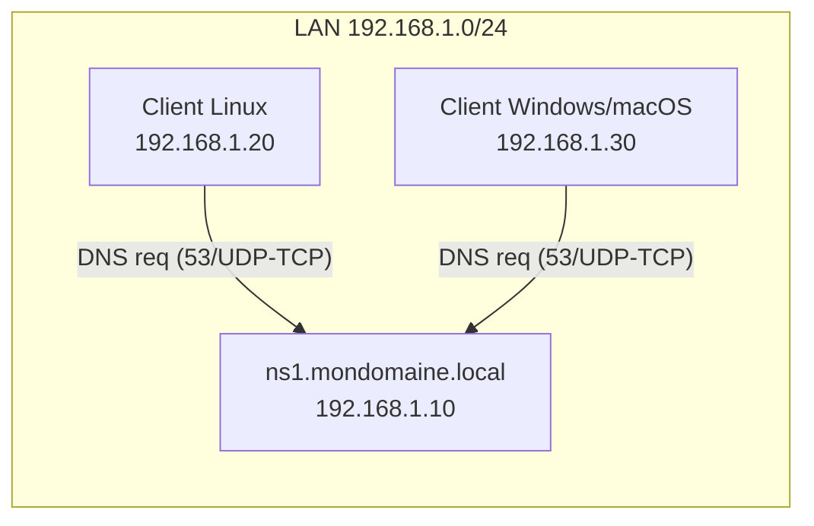

<div align="center">

  <br></br>
  
  <a href="https://github.com/0xCyberLiTech">
    
  </a>
  
  <br></br>
  
  <h2>Laboratoire numérique pour la cybersécurité, Linux & IT.</h2>


  <p align="center">
    <a href="https://0xcyberlitech.github.io/">
      
    </a>
    <a href="https://github.com/0xCyberLiTech">
      
    </a>
    <a href="https://github.com/0xCyberLiTech/DNS/releases/latest">
      
    </a>
    <a href="https://github.com/0xCyberLiTech/DNS/blob/main/CHANGELOG.md">
      
    </a>
    <a href="https://github.com/0xCyberLiTech?tab=repositories">
      
    </a>
    <a href="https://github.com/0xCyberLiTech/DNS/graphs/contributors">
      
    </a>
  </p>

</div>

<div align="center">
  
</div>

<div align="center">
  <p>
    <strong>Cybersécurité</strong>  • <strong>Linux Debian</strong>  • <strong>Sécurité informatique</strong> 
  </p>
</div>

---

<div align="center">
  
## À propos & Objectifs.

</div>

Ce projet propose des solutions innovantes et accessibles en cybersécurité, avec une approche centrée sur la simplicité d’utilisation et l’efficacité. Il vise à accompagner les utilisateurs dans la protection de leurs données et systèmes, tout en favorisant l’apprentissage et le partage des connaissances.

Le contenu est structuré, accessible et optimisé SEO pour répondre aux besoins de :
- 🎓 Étudiants : approfondir les connaissances
- 👨‍💻 Professionnels IT : outils et pratiques
- 🖥️ Administrateurs système : sécuriser l’infrastructure
- 🛡️ Experts cybersécurité : ressources techniques
- 🚀 Passionnés du numérique : explorer les bonnes pratiques

---

# TP pas à pas — Installation & configuration d’un **serveur DNS Maître** (BIND9) sous **Debian 13 (Trixie)**

> **Objectif pédagogique**  
> À la fin de ce TP, vous saurez installer, configurer, tester et sécuriser un **serveur DNS maître** avec **BIND9** sur Debian 13.  
> Vous créerez une **zone directe** et une **zone inverse**, vérifierez la configuration, puis effectuerez des tests de résolution depuis le serveur et un poste client.

---

## 0) Contexte, prérequis & topologie

### Contexte
- Système : **Debian 13 (Trixie)**, stable depuis août 2025
- Rôle : **DNS Maître** pour un domaine interne d’exemple `mondomaine.local`
- Hôte DNS : `ns1.mondomaine.local`
- IP fixe : `192.168.1.10/24` (passerelle `192.168.1.1`)

> Adaptez *domaine*, *noms d’hôtes* et *adresses IP* à votre environnement.

### Pré-requis
- Accès `sudo` ou root
- Heure système correcte (NTP de préférence)
- Un poste client Linux (Debian/Ubuntu) ou Windows pour tester

### Schéma de la topologie (ASCII)
```
             ┌───────────────────────────────────────────┐
             │                Réseau LAN                 │
             │                192.168.1.0/24             │
             └───────────────────────────────────────────┘
                        │
                        │
                ┌───────┴────────┐
                │   DNS Maître   │
                │ ns1.mondomaine │
                │ 192.168.1.10   │
                └───────┬────────┘
                        │
        ┌───────────────┴────────────────┐
        │                                │
┌───────▼────────┐                ┌──────▼────────┐
│  Client Linux  │                │ Client Win/OS │
│ 192.168.1.20   │                │ 192.168.1.30  │
└────────────────┘                └───────────────┘
        (utilisent ns1 = 192.168.1.10 comme résolveur primaire)
```

### Schéma Mermaid (collable dans https://mermaid.live/)


---

## 1) Étape 1 — Préparer l’IP **statique** du serveur

1. Vérifier l’interface réseau :  
   ```bash
   ip -br a
   ```
2. Configurer l’IP statique via **systemd-networkd** ou **NetworkManager**. Exemple (NetworkManager, fichier keyfile) :
   ```ini
   # /etc/NetworkManager/system-connections/lan.nmconnection
   [connection]
   id=lan
   type=ethernet
   interface-name=eth0
   autoconnect=true

   [ipv4]
   method=manual
   addresses=192.168.1.10/24
   gateway=192.168.1.1
   dns=127.0.0.1;
   dns-search=mondomaine.local;

   [ipv6]
   method=disabled
   ```
   Puis :
   ```bash
   sudo nmcli connection reload
   sudo nmcli connection up lan
   ```

> **Pourquoi `dns=127.0.0.1` ?** Sur le **serveur DNS**, on résoudra en local via BIND9.  
> **Sur les clients**, on pointera vers **192.168.1.10** (ns1).

---

## 2) Étape 2 — Installer BIND9 et outils

```bash
sudo apt update && sudo apt -y upgrade
sudo apt install -y bind9 bind9-utils bind9-dnsutils
named -v     # doit afficher BIND 9.20.x (Debian 13)
```

Fichiers principaux utiles (Debian) :  
- `/etc/bind/named.conf` (inclut les autres)  
- `/etc/bind/named.conf.options` (options globales)  
- `/etc/bind/named.conf.local` (déclaration des zones locales)  
- `/var/cache/bind/` (cache, clés…)  
- Journaux via `journalctl -u bind9` (par défaut, AppArmor actif)

---

## 3) Étape 3 — Paramètres globaux de BIND9

Éditez **/etc/bind/named.conf.options** :
```bash
sudo nano /etc/bind/named.conf.options
```
Exemple **sécurisé pour un DNS d’autorité (maître)** dans un LAN :
```conf
options {
    directory "/var/cache/bind";

    listen-on { 127.0.0.1; 192.168.1.10; };
    listen-on-v6 { none; };

    recursion no;
    allow-query { 127.0.0.1; 192.168.1.0/24; };
    allow-transfer { none; };
    version "not disclosed";
};
```

Vérifiez la syntaxe :
```bash
sudo named-checkconf
```

---

## 4) Étape 4 — Déclarer les **zones** (fichier local)

Éditez **/etc/bind/named.conf.local** :
```bash
sudo nano /etc/bind/named.conf.local
```

Ajoutez **votre zone directe** et **zone inverse** :
```conf
zone "mondomaine.local" {
    type master;
    file "/etc/bind/db.mondomaine.local";
};

zone "1.168.192.in-addr.arpa" {
    type master;
    file "/etc/bind/db.192.168.1";
};
```

---

## 5) Étape 5 — Créer la **zone directe** (db.mondomaine.local)

1. Partir d’un modèle :
   ```bash
   sudo cp /etc/bind/db.local /etc/bind/db.mondomaine.local
   sudo nano /etc/bind/db.mondomaine.local
   ```

2. Exemple :
   ```zone
   $TTL    86400
   @       IN      SOA     ns1.mondomaine.local. admin.mondomaine.local. (
                           2025083001 ; Serial
                           3600       ; Refresh
                           1800       ; Retry
                           1209600    ; Expire
                           86400 )    ; Negative caching

   @       IN      NS      ns1.mondomaine.local.

   ns1     IN      A       192.168.1.10
   @       IN      A       192.168.1.10
   www     IN      A       192.168.1.20
   mail    IN      A       192.168.1.30

   @       IN      MX 10   mail.mondomaine.local.
   intranet IN     CNAME   www.mondomaine.local.
   web      IN     CNAME   www.mondomaine.local.
   ```

Vérifiez la zone :
```bash
sudo named-checkzone mondomaine.local /etc/bind/db.mondomaine.local
```

---

## 6) Étape 6 — Créer la **zone inverse** (db.192.168.1)

```bash
sudo cp /etc/bind/db.127 /etc/bind/db.192.168.1
sudo nano /etc/bind/db.192.168.1
```

Exemple :
```zone
$TTL    86400
@       IN      SOA     ns1.mondomaine.local. admin.mondomaine.local. (
                           2025083001
                           3600
                           1800
                           1209600
                           86400 )

@       IN      NS      ns1.mondomaine.local.

10      IN      PTR     ns1.mondomaine.local.
20      IN      PTR     www.mondomaine.local.
30      IN      PTR     mail.mondomaine.local.
```

Vérifiez la zone :
```bash
sudo named-checkzone 1.168.192.in-addr.arpa /etc/bind/db.192.168.1
```

---

## 7) Étape 7 — Redémarrage, activation & statut

```bash
sudo systemctl restart bind9
sudo systemctl enable bind9
systemctl status bind9 --no-pager
journalctl -u bind9 -b --no-pager
```

---

## 8) Étape 8 — Tests de résolution

Sur le serveur :  
```bash
dig @127.0.0.1 mondomaine.local +noall +answer
dig @127.0.0.1 www.mondomaine.local +noall +answer
dig @127.0.0.1 mondomaine.local MX +noall +answer
dig @127.0.0.1 -x 192.168.1.20 +noall +answer
```

Sur un client Linux :  
```bash
dig @192.168.1.10 www.mondomaine.local +noall +answer
host 192.168.1.30 192.168.1.10
```

Sur un client Windows :  
```powershell
nslookup
> server 192.168.1.10
> www.mondomaine.local
```

---

## 9) Étape 9 — Pare-feu

**UFW**
```bash
sudo ufw allow 53/udp
sudo ufw allow 53/tcp
sudo ufw reload
```

**nftables (exemple)**
```nft
table inet filter {
  chain input {
    type filter hook input priority 0;
    iif "lo" accept
    ct state established,related accept
    ip saddr 192.168.1.0/24 udp dport 53 accept
    ip saddr 192.168.1.0/24 tcp dport 53 accept
    reject with icmpx type admin-prohibited
  }
}
```

---

## 10) Sécurisation

- `recursion no;`
- `allow-query { 192.168.1.0/24; };`
- `allow-transfer { none; };`
- `version "not disclosed";`
- Surveiller les mises à jour de BIND9 (9.20 sous Debian 13)
- Vérifier régulièrement les journaux : `journalctl -u bind9`

---

## 11) Validation rapide

1. Rôle du **Serial** ?  
2. Directive qui désactive la récursion ?  
3. Pourquoi un **PTR** ?  
4. Commande pour vérifier une zone ?  
5. Protocoles utilisés par DNS ?  

Réponses : (1) Propagation des maj, (2) `recursion no;`, (3) Résolution inverse, (4) `named-checkzone`, (5) UDP et TCP port 53.

---

## 12) Dépannage

- **SERVFAIL** : faute de syntaxe ou serial non incrémenté  
- **NXDOMAIN** : nom inexistant ou mauvais FQDN  
- **Pas de réponse** : client ne pointe pas sur le bon DNS ou firewall  
- **Zone inverse** : vérifier le nom exact `in-addr.arpa`  

Commandes utiles :  
```bash
sudo named-checkconf
sudo named-checkzone mondomaine.local /etc/bind/db.mondomaine.local
sudo named-checkzone 1.168.192.in-addr.arpa /etc/bind/db.192.168.1
sudo rndc reload
journalctl -u bind9 -f
```

---

**Fin du TP **

---

<div align="center">
  <a href="https://github.com/0xCyberLiTech" target="_blank" rel="noopener">
    
  </a>
</div>

<div align="center">
  <b>🔒 Un guide proposé par <a href="https://github.com/0xCyberLiTech">0xCyberLiTech</a> • Pour des tutoriels accessibles à tous. 🔒</b>
</div>

