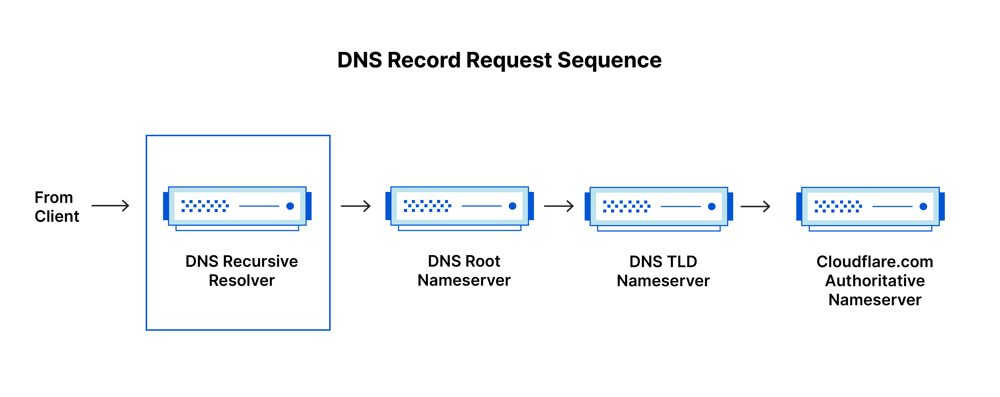
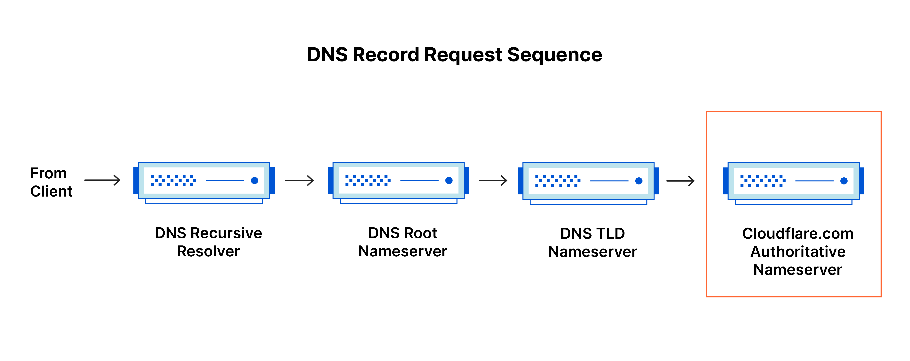

# - A. LE DNS (Domain Name System) :

| Cat | Etapes |
|------|------|
| - A. | [README.](README.md) |
| - B. | [Exemple_server_DNS_maître.](Exemple_server_DNS_maître.md) |
| - C. | [Exemple_server_DNS_esclave.](Exemple_server_DNS_esclave.md) |

## Qu'est-ce que le DNS ?

Le DNS (Domain Name System, système de nom de domaine) est en quelque sorte le répertoire téléphonique d'Internet. Les internautes accèdent aux informations en ligne via des noms de domaine (par exemple, nytimes.com ou espn.com), tandis que les navigateurs interagissent par le biais d'adresses IP (Internet Protocol, protocole Internet). Le DNS traduit les noms de domaine en adresses IP afin que les navigateurs puissent charger les ressources web.

Chaque appareil connecté à Internet dispose d'une adresse IP unique que les autres appareils utilisent afin de le trouver. Grâce aux serveurs DNS, les internautes n'ont pas à mémoriser les adresses IP (par exemple, 192.168.1.1 en IPv4) ni les adresses IP alphanumériques plus récentes et plus complexes (par exemple, 2400:cb00:2048:1::c629:d7a2 en IPv6).

## Comment fonctionne le DNS ?

Le processus de résolution DNS implique la conversion d'un nom d'hôte (par exemple, www.exemple.com) en adresse IP « au format informatique » (par exemple, 192.168.1.1). Chaque appareil relié à Internet se voit attribuer une telle adresse. Cette dernière permet de trouver l'appareil approprié sur Internet, de la même manière qu'une adresse dans une rue permet de trouver un domicile. Lorsqu'un utilisateur souhaite charger une page web, une traduction doit intervenir entre l'adresse que l'utilisateur saisit dans son navigateur (exemple.com) et l'adresse utilisable par la machine, nécessaire pour localiser la page web exemple.com.

Afin de comprendre le processus à l'œuvre derrière la résolution DNS, il est important de connaitre les différents composants physiques par lesquels une requête DNS doit passer. Du point de vue du navigateur, la recherche DNS s'effectue « en arrière-plan » et ne nécessite aucune interaction de l'ordinateur de l'utilisateur en dehors de la demande initiale.

Quatre serveurs DNS sont impliqués dans le chargement d'une page web.

- Récurseur DNS : le récurseur peut être considéré comme un bibliothécaire à qui l'on demande d'aller chercher un livre particulier quelque part dans une bibliothèque. Il s'agit d'un serveur conçu pour recevoir les requêtes des ordinateurs client par l'intermédiaire d'applications, telles que les navigateurs web. Généralement, le récurseur se charge ensuite d'effectuer les demandes supplémentaires nécessaires à la résolution de la requête DNS du client.

- Serveur de noms racine : le serveur racine constitue la première étape de la traduction (résolution) des noms d'hôtes lisibles par l'humain en adresses IP. Il s'agit en quelque sorte du catalogue d'une bibliothèque : il renvoie vers les différents rayonnages de livres et sert généralement de référence pour trouver d'autres emplacements plus spécifiques.

- Serveur de noms TLD : le serveur de domaine de premier niveau (TLD, top level domain) peut être considéré comme un rayonnage spécifique au sein d'une bibliothèque. Étape suivante dans la recherche d'une adresse IP spécifique, ce serveur de noms héberge la dernière partie d'un nom d'hôte (dans « exemple.com », le serveur TLD est ainsi « .com »).

- Serveur de noms de référence : ce dernier serveur de noms peut être considéré comme un dictionnaire situé sur un rayonnage. Il rend possible la traduction d'un nom spécifique sous forme d'une définition. Le serveur de noms de référence constitue la dernière étape d'une requête effectuée au serveur de noms. Si le serveur de noms de référence a accès à l'enregistrement demandé, il renvoie l'adresse IP du nom d'hôte demandé au récurseur DNS (le bibliothécaire) qui a effectué la requête initiale.

Quelle est la différence entre un serveur DNS de référence et un résolveur DNS récursif ?

Si les deux concepts font référence à des serveurs (groupe de serveurs) faisant partie intégrante de l'infrastructure DNS, ils présentent chacun un rôle différent et ne se situent pas au même emplacement dans le pipeline d'une requête DNS. Pour comprendre la différence entre les deux, il suffit de se souvenir que le résolveur récursif se trouve au début de la requête DNS et le serveur de noms de référence à la fin.

Résolveur DNS récursif :

Le résolveur récursif désigne l'ordinateur qui répond à la requête récursive d'un client et prend le temps de suivre l'enregistrement DNS. Il lance pour cela une série de requêtes jusqu'à atteindre le serveur de noms DNS de référence pour l'enregistrement demandé (la requête expire ou renvoie une erreur si aucun enregistrement n'est trouvé). Heureusement, les résolveurs DNS récursifs n'ont pas toujours à effectuer plusieurs requêtes pour rechercher les enregistrements permettant de répondre à un client. En tant que processus de persistance des données, la mise en cache permet de court-circuiter les requêtes nécessaires en fournissant l'enregistrement de la ressource demandée plus tôt au sein de la recherche DNS.

Serveur DNS de référence :

En clair, le terme serveur DNS de référence désigne un serveur détenant réellement les enregistrements de ressources DNS et responsable de ces derniers. Situé tout en bas de la chaîne de recherche DNS, ce serveur répond en renvoyant l'enregistrement de la ressource recherchée. Ce faisant, il permet finalement au navigateur web effectuant la requête d'atteindre l'adresse IP nécessaire pour accéder à un site web ou à d'autres ressources web. Un serveur de noms de référence peut satisfaire les requêtes à partir de ses propres données sans avoir à interroger une autre source, car il s'agit de la source unique de vérité pour certains enregistrements DNS.

